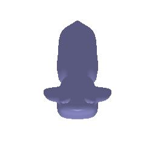
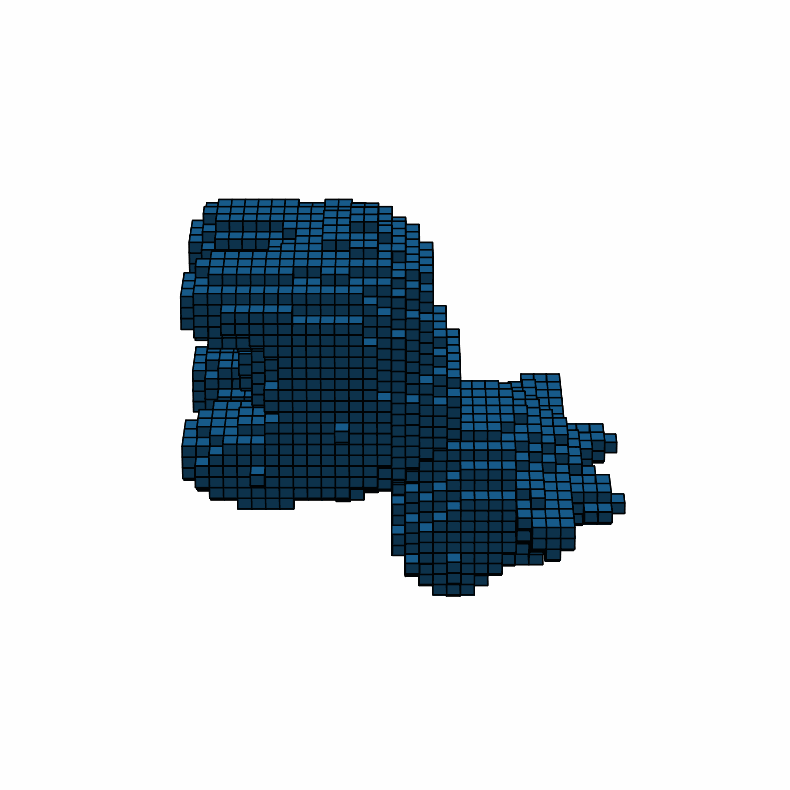

# 3D_assignments: Learn about 3D representations
This repository is designed for VDT 2025. In this assignment, you will learn the basics of rendering with PyTorch3D,
explore 3D representations, and practice constructing simple geometry.

## SETUP
You will need to install Pytorch3d. See the directions for your platform
[here](https://github.com/facebookresearch/pytorch3d/blob/main/INSTALL.md).
You will also need to install Pytorch. If you do not have a GPU, you can directly pip
install it (`pip install torch`). Otherwise, follow the installation directions
[here](https://pytorch.org/get-started/locally/).

Other miscellaneous packages that you will need can be installed using the 
`requirements.txt` file (`pip install -r requirements.txt`).


```bash
# GPU Installation on a CUDA 11.8 Machine
conda create -n learning3d python=3.10
pip install torch --index-url https://download.pytorch.org/whl/cu118 (modify according to your cuda version)
pip install fvcore iopath
conda install -c bottler nvidiacub 
pip install kaolin==0.17.0 -f https://nvidia-kaolin.s3.us-east-2.amazonaws.com/torch-2.1.0_cu118.html (modify according to your torch version)
MAX_JOBS=8 pip install "git+https://github.com/facebookresearch/pytorch3d.git@stable" (this will take some time to compile)
pip install -r requirements.txt
```
## Practice
### Render your first mesh
To render a mesh using Pytorch3D, you will need a mesh that defines the geometry and
texture of an object, a camera that defines the viewpoint, and a Pytorch3D renderer
that encapsulates rasterization and shading parameters. You can abstract away the
renderer using the `get_mesh_renderer` wrapper function in `render_mesh.py`:
```python
renderer = get_mesh_renderer(image_size=512)
```

Meshes in Pytorch3D are defined by a list of vertices, faces, and texture information.
We will be using per-vertex texture features that assign an RGB color to each vertex.
You can construct a mesh using the `pytorch3d.structures.Meshes` class:
```python
vertices = ...  # 1 x N_v x 3 tensor.
faces = ...  # 1 x N_f x 3 tensor.
textures = ...  # 1 x N_v x 3 tensor.
meshes = pytorch3d.structures.Meshes(
    verts=vertices,
    faces=faces,
    textures=pytorch3d.renderer.TexturesVertex(textures),
)
```
Note that Pytorch3D assumes that meshes are *batched*, so the first dimension of all
parameters should be 1. You can easily do this by calling `tensor.unsqueeze(0)` to add
a batch dimension.

Cameras can be constructed using a rotation, translation, and field-of-view
(in degrees). A camera with identity rotation placed 3 units from the origin can be
constructed as follows:
```python
cameras = pytorch3d.renderer.FoVPerspectiveCameras(
    R=torch.eye(3).unsqueeze(0),
    T=torch.tensor([[0, 0, 3]]),
    fov=60,
)
```
Again, the rotation and translations must be batched. **You should familiarize yourself
with the [camera coordinate system](https://pytorch3d.org/docs/cameras) that Pytorch3D
uses. This wil save you a lot of headaches down the line.**

Finally, to render the mesh, call the `renderer` on the mesh, camera, and lighting
(optional). Our light will be placed in front of the cow at (0, 0, -3).
```python
lights = pytorch3d.renderer.PointLights(location=[[0, 0, -3]])
rend = renderer(mesh, cameras=cameras, lights=lights)
image = rend[0, ..., :3].numpy()
```
The output from the renderer is B x H x W x 4. Since our batch is one, we can just take
the first element of the batch to get an image of H x W x 4. The fourth channel contains
silhouette information that we will ignore, so we will only keep the 3 RGB channels.

Please take a close look at the code and make sure you understand how it works. If you run `python render_mesh.py`, you should see
the following output:


### Synthesis views

Your first task is to create a 360-degree gif video that shows many continuous views of the provided cow mesh. You will be expected to show full turntable views of your outputs. You may find the following helpful:
* [`pytorch3d.renderer.look_at_view_transform`](https://pytorch3d.readthedocs.io/en/latest/modules/renderer/cameras.html#pytorch3d.renderer.cameras.look_at_view_transform):
Given a distance, elevation, and azimuth, this function returns the corresponding
set of rotations and translations to align the world to view coordinate system.
* Rendering a gif given a set of images:
```python
import imageio

for azimuth in torch.linspace(0,360, num_images):
    R,T = pytorch3d.renderer.cameras.look_at_view_transform(dist=2,\
        elev = 0, azim = azimuth)
    cameras = pytorch3d.renderer.FoVPerspectiveCameras(
    R=R,T=T, fov=60, device=device)
    lights = pytorch3d.renderer.PointLights(location=[[0,0,-3]], device=device)
    
    rend = renderer(point_cloud, cameras = cameras, lights = lights)
    image= rend.cpu().numpy()[0,...,:3]# (B, H, W, 4) -> (H, W, 3)
    images.append((image*255).astype('uint8'))


my_images = ...  # List of images [(H, W, 3)]
imageio.mimsave('my_gif.gif', my_images, fps=15)
```

### Camera Transformations

When working with 3D, finding a reasonable camera pose is often the first step to
producing a useful visualization, and an important first step toward debugging.

What are the relative camera transformations that would produce the following output image? You shoud find a set (R_relative, T_relative) such that the new camera
extrinsics with `R = R_relative @ R_0` and `T = R_relative @ T_0 + T_relative` produces
each of the following images:


### Mesh to PointCloud

It's time to focus on converting a 3D triangle mesh into a point cloud representation – a set of discrete 3D points that approximate the surface of the object.

If you run `python mesh2pc.py`, you should get the following output:


### Mesh to Voxel

Now,you will learn how to convert a 3D triangle mesh into a voxel representation – a 3D grid of small cubes (voxels) that represent the occupied space of the object. This process is essential in various 3D workflows such as reconstruction, deep learning for 3D, and physical simulation.
If you run `python mesh2voxel.py`, you should get the following output:

